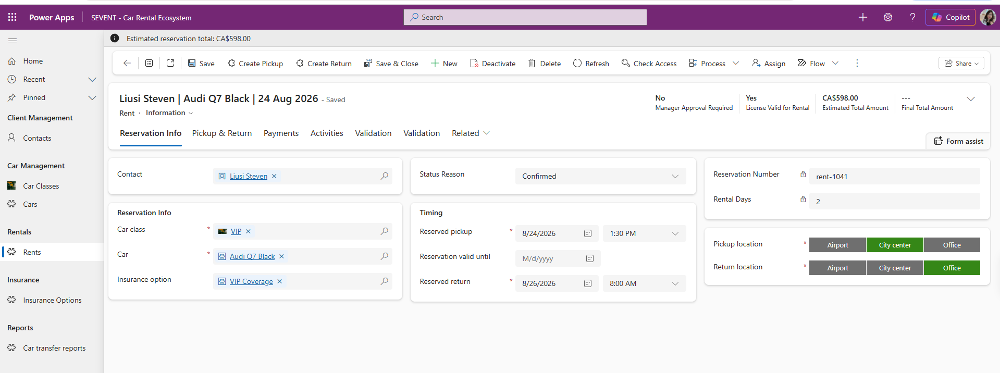
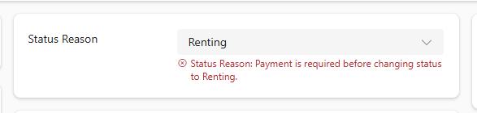
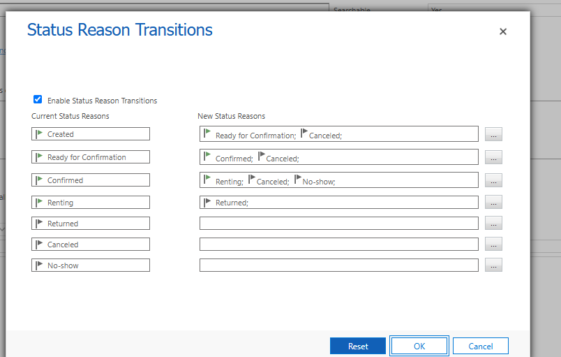
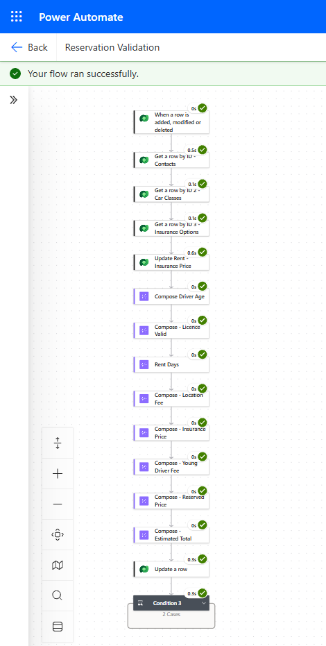
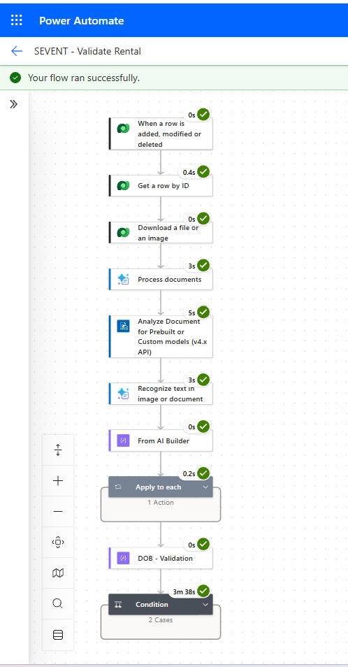
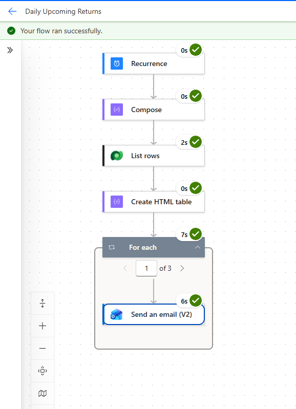
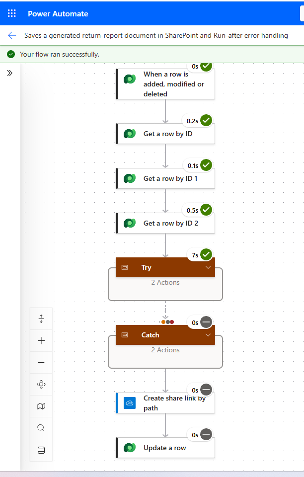
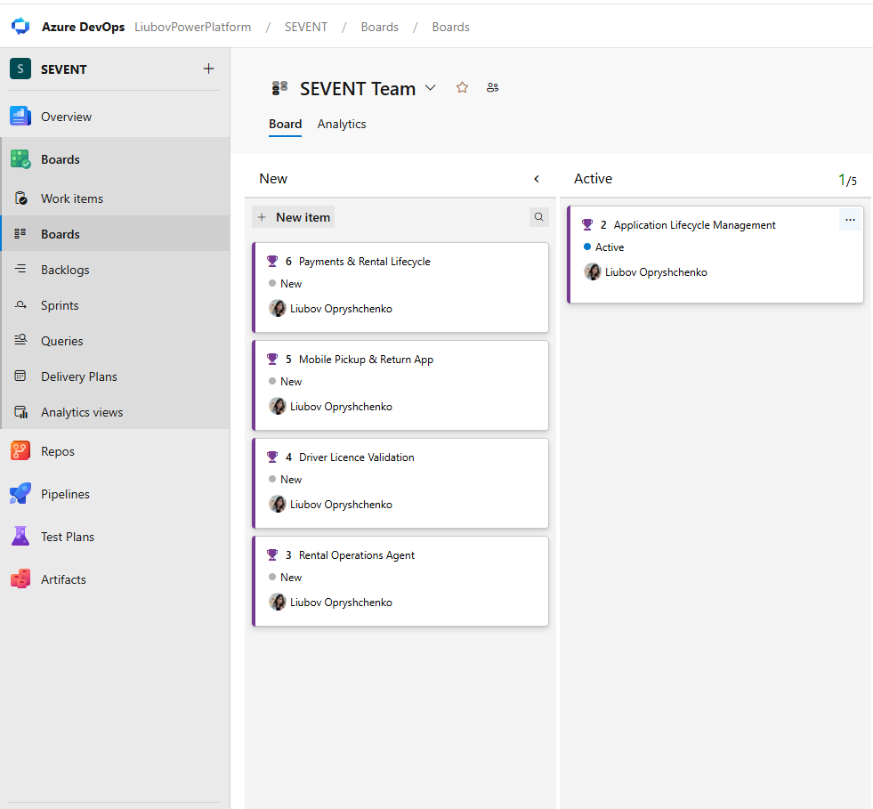
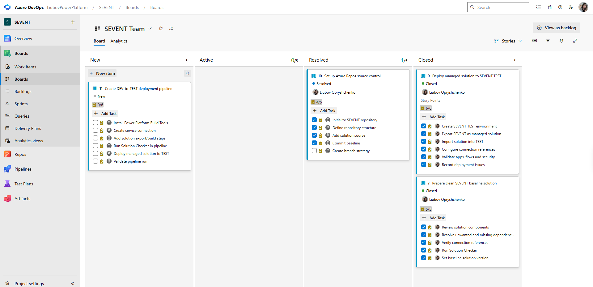

# SEVENT – Power Platform Car Rental Ecosystem

SEVENT is an evolving portfolio project built with Microsoft Dynamics 365 and Power Platform to model an end-to-end car rental process.

The project originally started as a Dynamics 365 development exercise using C# plug-ins and JavaScript. It has since evolved into a broader Power Platform solution that includes Dataverse, Model-driven Apps, Power Automate, Power Pages, AI-assisted document processing, and Application Lifecycle Management with Azure DevOps.

The goal of the project is to build practical experience with both functional solution design and technical development using realistic business scenarios.

---

## Technology Stack

- Microsoft Dataverse
- Model-driven Power Apps
- Power Automate
- Power Pages
- Microsoft Copilot Studio
- Azure AI Document Intelligence
- C# Dataverse plug-ins
- JavaScript web resources
- Microsoft Teams integration
- Azure DevOps Boards
- Azure Repos / Git
- Power Platform CLI (PAC CLI)

---

## Project Status

SEVENT is developed iteratively and tested as the solution evolves.

### Implemented and Demonstrated

- Dataverse data model and relationships
- Model-driven rental management application
- JavaScript pricing and form validation
- C# server-side business validation
- Rental status lifecycle
- Payment tracking and validation
- Power Automate notifications
- Microsoft Teams integration
- Managed DEV-to-TEST solution deployment
- Azure DevOps Boards
- Azure Repos source control using PAC CLI

### In Progress

- Rental Operations Agent with Copilot Studio
- AI-assisted driver licence validation
- Additional Power Automate flows
- Business Process Flow and lifecycle refinements
- Power Pages refinements
- DEV-to-TEST deployment pipeline
- Mobile Pickup & Return experience

---

## Solution Overview

SEVENT is designed to support the main stages of a car rental lifecycle:

**Reservation → Validation → Confirmation → Pickup → Renting → Return → Payment**

The solution covers customer management, vehicle availability, pricing, rental validation, approvals, payments, pickup and return operations, and customer self-service.

Some capabilities are complete, while others are actively being developed and tested.

---

## Dataverse Data Model

Main tables include:

- Contact
- Rent
- Car
- Car Class
- Insurance Option
- Payment
- Car Transfer Report / Vehicle Inspection
- Branch

Dataverse relationships connect customer, vehicle, reservation, payment, and rental-operation information.

---

## Model-driven Application

The internal SEVENT application supports rental employees and managers.

Key capabilities include:

- Create and manage reservations
- Select vehicle class and vehicle
- Calculate rental duration and estimated price
- Manage pickup and return locations
- Track rental lifecycle using Status Reason
- Validate required rental information
- Create pickup and return reports
- Track payments
- Support manager approval scenarios

### Rental Management



---

## JavaScript

JavaScript is used for client-side form behaviour, calculations, and immediate user feedback.

Examples include:

- Filtering vehicles by selected Car Class
- Reservation date validation
- Rental-day calculation
- Price calculation
- Conditional field behaviour
- Form notifications and validation

JavaScript examples are available in the [`scripts`](./scripts) folder.

---

## C# Plug-ins

The project includes Dataverse plug-ins for server-side business validation.

Examples include:

- Status transition validation
- Required-field validation
- Payment validation before rental lifecycle transitions
- Vehicle and rental business rules
- Pickup and return validation

The plug-in source code is available in the [`src`](./src) folder.

### Server-side Business Validation

For example, the rental cannot move to the **Renting** status when required payment conditions are not satisfied.



---

## Rental Lifecycle

Status Reason transitions are used to control valid rental lifecycle changes.

Example lifecycle:

**Created → Ready for Confirmation → Confirmed → Renting → Returned**

Cancellation and no-show scenarios are also supported.



---

## Power Automate

Power Automate is used throughout SEVENT for business logic, integrations, scheduled processing, document generation, notifications, approvals, and AI-assisted validation.

Automation scenarios include:

- Reservation validation and pricing calculations
- Driver age and licence validation
- Rental fee calculations
- Microsoft Teams and email notifications
- Manager approval workflows
- Scheduled upcoming-return processing
- Word template document generation
- SharePoint document storage
- Rental summary communication
- AI-assisted driver licence processing
- Error handling using Try/Catch-style scopes

### Rental Pricing and Validation

One of the main automation processes combines Dataverse data from the customer, vehicle, car class, and insurance records to calculate rental-related values and validate reservation conditions.

The flow handles values such as driver age, licence validity, rental days, location fees, insurance pricing, young-driver fees, reserved price, and estimated rental total.



### AI-assisted Driver Licence Validation

The driver licence validation workflow combines Dataverse, document processing, Azure AI Document Intelligence, AI Builder, and business validation logic.

The feature is still being refined and tested as part of the SEVENT roadmap.



### Scheduled Rental Operations

A scheduled Power Automate flow checks upcoming vehicle returns, retrieves relevant Dataverse records, prepares the information, and sends notifications.

This automation has also been tested through recurring scheduled executions.



### Error Handling

Testing has also helped improve flow reliability.

For example, a document-processing flow originally failed when an expected file or image was unavailable. The flow was redesigned to use Try/Catch-style scopes so expected failures can be handled more safely instead of relying only on the happy path.


---

## Power Pages

A Power Pages portal provides a customer-facing layer for reservation-related scenarios.

The portal is connected to Dataverse and is being developed to support customer self-service using Power Pages security, web roles, and table permissions.

This part of the project is currently being refined.

---

## AI-assisted Driver Licence Validation

SEVENT includes an AI-assisted driver licence validation scenario.

The current design uses:

- Azure AI Document Intelligence
- Power Automate
- Dataverse
- Driver licence data extraction
- Licence expiry validation
- Age validation
- Manager approval when required
- Human review for uncertain results

This feature is currently under development and testing.

---

## Rental Operations Agent

A Rental Operations Agent is being developed with Microsoft Copilot Studio.

The planned agent will help with scenarios such as:

- Reservation validation
- Rental status checks
- Missing-information detection
- Business-rule guidance
- Manager escalation
- Rental operation support

**Status: In progress**

---

## Azure DevOps Project Management

SEVENT development is organized in Azure DevOps.

The project backlog includes several functional and technical workstreams:

- Application Lifecycle Management
- Rental Operations Agent
- Driver Licence Validation
- Mobile Pickup & Return App
- Payments & Rental Lifecycle



Azure Boards is also used to break work down into:

**Epic → Feature → User Story → Task / Bug**

### ALM Work Tracking

Solution preparation, managed deployment, source control, and future pipeline automation are tracked as individual work items.



---

## Application Lifecycle Management

SEVENT now uses separate development and testing environments.

Current workflow:

```text
DEV
 ↓
Unmanaged development solution
 ↓
Managed solution export
 ↓
SEVENT TEST
 ↓
Functional validation